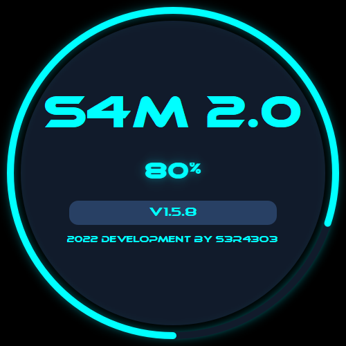
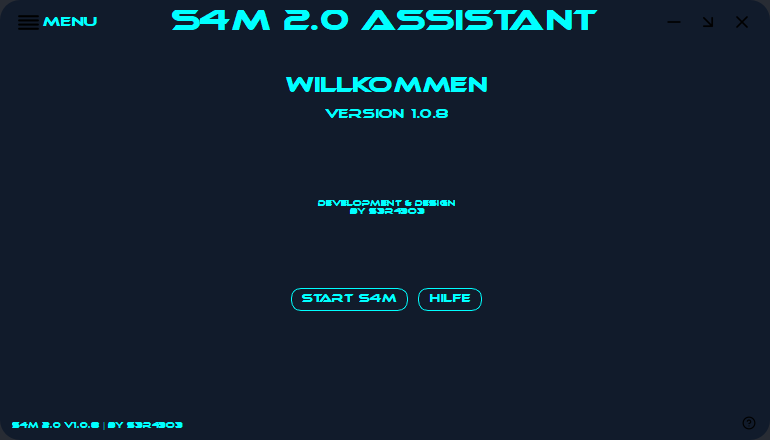
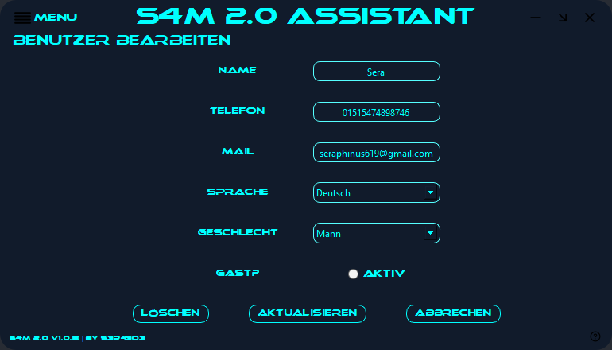

###### This README is currently work in progress ######

# S4M 2.0 Voiceassistant #

**TecAlpha Version**

---
**!IMPORTANT!**

**While this project is under alpha development it will be only available in german !**

*Notice: This will be changed if a stable release version is available.*

---

## Was ist S4M ##

> S4M ist ein Sprachassistent der, wie die bekannten anderen Assistenten Siri oder Alexa, euch mit verschiedenen Funktionen unterstützen kann. Simple Zeitabfragen oder Todo-Listen. Musikplayer und die Möglichkeit mit anderen S4M's per LiveChat zu sprechen. Weitere Features sind in Planung.
>
>S4M ist in der Lage den Gesprächspartner zu erkennen und dann individuell auf den gespeicherten Benutzer zu reagieren.

---

>S4M hat aktuell **70 696** Zeilen handgeschrieben Code.
>
> 

---

## Features ##

| **Features** |**Beschreibung**|
|:------:|:--------|
|*Benutzererkennung*| S4M erkennt das Tonprofil des Sprechers und kann so vor unbefugten Nutzern schützen.|
|*dynamische Kommandoerkennung*|Keine Abfrage von kompletten Templatetexten. S4M reagiert auf Schlüsselbegriffe in Sätzen und lernt dabei deine Stimme und Sprechweise immer besser zu verstehen.|
|*Kein BIGDATA*| S4M verwendet keine Cloud und benötigt keine sensiblen Daten. Jegliche Angabe von privaten Daten ist und bleibt freiwillig. Diese Daten werden lokal auf deinem System gespeichert und verwaltet!|
|*Tierstimmen*| Wie seine Verwandten kann auch S4M Tierstimmen immitieren. Zurzeit sind 26 verfügbar.|
|*Wikipedia*|Die größte Enzyklopädie der Welt steht dir zur Verfügung.|
|*Erinnerungen*|Nichts mehr vergessen! Speichere Termine oder stelle einen Wecker.|
|*Smart Home*| Anbindung an deine Smart-Home Geräte.|
|*Wetter Station*|Wettervorhersagen mit Temparatur, Luftdruck und alles andere rund ums Wetter.|
|*Radiostream*|Radio-Streaming vom deutschen Rundfunk.|
|*Musicplayer*|Natürlich kannst du auch einfach deine eigene Playlist abspielen.|
|*Quiz Game*| Ein kleines Quiz für helle Köpfe!|
|*Password Manager*| Per Stimmabgleich gesicherter Passwortmanager.|
|*Benutzerfreundliches Userinterface*| Beim Dysign und Funktionen des [User-Interface](https://github.com/sera619/S4M-2.0#preview) wurde auf Benutzerfreundlichkeit viel Wert gelegt.|

---

## FAQ ##

*Wann wird S4M 2.0 veröffentlicht?*
> Aktuell befindet sich S4M in einem frühen Entwicklungsstadium. Sobald eine erste Alpha-Version verfügbar ist wirst du hier informiert!

*Für welche Plattformen ist S4M 2.0 verfügbar?*
> S4M 2.0 wird zunächst für Windows10/11 verfügbar sein. Eine andere Plattform ist bisher nicht geplant. Das bedeutet aber nicht das sich das nicht in Zukunft ändern kann.

*Welche Daten speichert S4M 2.0?*
>S4M speichert **KEINE** empfindlichen privaten Daten. Die Authentifizierung erfolgt über Stimmabgleich. Diese Daten werden lokal auf deinem System gespeichert. Diese Daten **BLEIBEN** auf deinem System!

*Was brauche ich um S4M 2.0 zu benutzen?*
>Um S4M 2.0 zu verwenden benötigst du:
>
> - Windows PC 10/11
> - funktionierendes Microphon
> - Einen Breitband-Internetanschluss (DSL)

*Braucht S4M 2.0 immer einer Internetverbindung?*
>Nein, S4M 2.0 bringt alles was er braucht mit. Jedoch sind dann Funktionen die den Zugriff auf das Internet benötigen nicht mehr verfügbar.

---

## Preview ##

Da sich S4M 2.0 langsam in den Breich einer ersten open Beta bewegt, gibt es hier Vorab schoneinmal das User-Interface:
>
   > 
>
   > 
>
   > 
